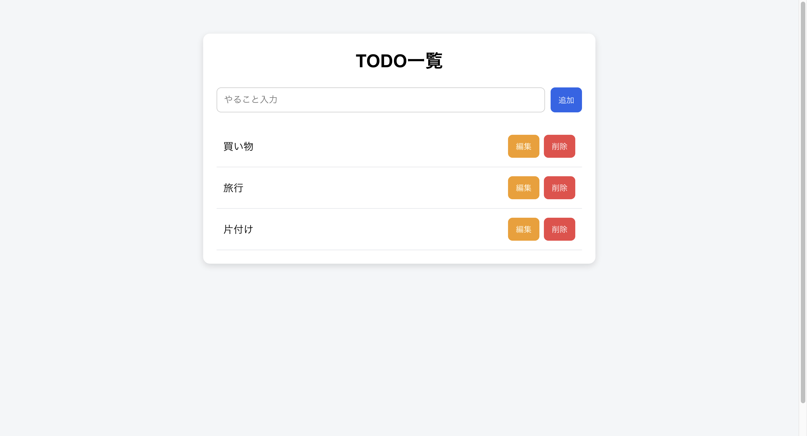

TODOアプリ（React × Spring Boot × PostgreSQL）

1.「概要」
React + Spring Boot + PostgreSQL を使用したシンプルなTODO管理アプリです。
フロントエンドとバックエンドを統合し、1つのアプリとして動作します。

- 画面イメージ

2.「主な機能」
・TODO一覧表示
・TODO追加
・TODO削除
・TODO更新（編集）
・入力バリデーション（空文字禁止）

3.「技術スタック」
[フロントエンド]
・React
・Axios
[バックエンド]
・Spring Boot
・Spring Data JPA
[データベース]
・PostgreSQL
[その他]
・Git / GitHub

4.「アーキテクチャ」
Browser
　↓
Spring Boot（8080）
├─ React（build済み静的ファイル）
└─ REST API（/api/todos）
　↓
PostgreSQL

5.「セットアップ方法」
①リポジトリをクローン
git clone https://github.com/harukihub/todo-app.git
cd todo-app
②PostgreSQL 起動 & DB作成
createdb myapp
※application.propertiesの設定を確認
③バックエンド起動
./mvnw spring-boot:run
④ブラウザでアクセス
http://localhost:8080

6.「APIエンドポイント」
GET /api/todos - 一覧取得
POST /api/todos - 追加
PUT /api/todos/{id} - 更新
DELETE /api/todos/{id} - 削除

7.「バリデーション」
・titleは必須（空文字禁止）
・フロント・バックエンド両方でチェック

8.「本番ビルド」
cd frontend
npm run build
→build成果物をSpring Bootに統合

9.「今後の改善」
・ログイン機能
・デプロイ
・UI改善
・ページネーション

10.「作成者」
・GitHub: https://github.com/harukihub
